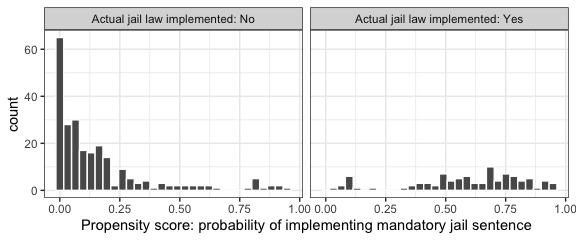
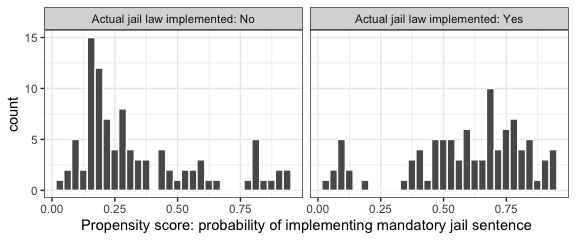

Team ID: Team 6

NAME: Connor Rosenberg NAME: Rongkui Han NAME: Yuqing Yang NAME: Nassim
Ali-Chaouche

Github: https://github.com/STA207/Presentation

Introduction
============

Background
----------

Traffic accidents cause thousands of deaths in the United States every
year. Data pertinent to US traffic fatalities from 1982 to 1988 can be
easily accessed in the AER "Fatalities" dataset. The data was obtained
from sources such as the US Department of Transportation Fatal Accident
Reporting System (FARS) and the US Bureau of Labor Statistics. The
dataset includes panel data for 48 states (Alaska and Hawaii not
included), containing demographic variables such as population, income
per capita, religious belief, and unemployment rate. In addition,
features that are commonly associated with traffic accidents and its
regulation, such as average miles per driver, percentage of young
drivers, tax collected per case of beer, presence of a preliminary
breath test law, and whether the state implemented mandatory jail
sentences or community service for an initial drunk driving conviction,
were also presented in the dataset. Finally, the number of vehicle
fatalities and its numerous subsets, such as night-time or
single-vehicle fatalities, were introduced. The observations were
recorded for each state annually. In total, there are 336 observations
recorded for 34 distinct variables.

Due to the observational nature of the data, obtaining causal effects
may pose a challenge. In observational studies, treatment selection is
influenced by subject characteristics. In the context of our study,
"treatment assignment" refers to whether a state has a mandatory jail
sentence. It is not difficult to imagine that demographic
characteristics of a state can influence both its traffic legislations
as well as its traffic fatality rate, causing confounding effects. As a
result, systematic differences in baseline characteristics between
states with and without mandatory jail sentences must be taken into
account when estimating its effect on outcomes. The **propensity score**
is the probability of treatment assignment conditional on observed
baseline characteristics. The propensity score allows one to analyze an
observational study so that it mimics some of the particular
characteristics of a randomized controlled trial. In particular,
conditional on the propensity score, the distribution of observed
baseline covariates will be similar between treated and untreated
subjects, allowing the estimation of the average treatment effect
(Austin, 2011). In this report, we will attempt to discover the
potential causal relationship between mandatory jail sentences and State
traffic fatality rate using propensity score matching, followed by
mixed-effect ANOVA modeling.

Questions of Interest
---------------------

-   Are there demographic features that correlate with a state's
    mandatory jail sentence law?\
-   Is a state's mandatory jail sentence law associated with its annual
    traffic fatality rate, after adjusting for potential covariating
    demographic variables?\
-   Can we draw a causal conclusion regarding the relationship between a
    state's mandatory jail sentence law and its annual traffic fatality
    rate?

Analysis Plan
=============

Population and Study Design
---------------------------

The response variable used in this analysis is the yearly traffic
fatality rate per 10,000 State residents. The "Fatalities" dataset is a
panel dataset from 1982 to 1988. In a typical panel dataset, each
subject has multiple entries, some of which correspond to pre-treatment
records while others post-treatment. In this regard, the vehicle
fatality dataset is atypical, because only six out of 48 states had pre-
and post-treatment records (Figure 2). In fact, most states did not
change their policy. Due to this limitation, common panel data analysis
techniques are not applicable. In response, we will follow a
bench-marked pipeline for analyzing non-panel observational data under a
propensity score matching framework (Smith, 1997).

Propensity Score Analysis
-------------------------

### Propensity Score Estimation

We will estimate the propensity score through a logistic regression
model. The dependent variable is binary, indicating treatment status.
There is a lack of consensus in the literature as to which variables to
include in the propensity score model (Austin, 2001). Brookhart et al.
(2006) suggested that for practical purposes, it is safe to include all
potential confounding covariables in propensity score estimation. In
this study, 14 independent variables were included to account for
demographic characteristics that could potentially influence whether a
state mandates such a jail sentence. These variables include year,
population, gross state product (GSP), spirits consumption, unemployment
rate, per capita income, tax on a case of beer, percentage of baptists,
percentage of Mormons, minimum drinking age, percent residing in dry
counties, percentage of drivers younger than 24, average miles per
driver, and preliminary breath test upon initial drunk driving
conviction.

The output of this model is the propensity score, which equals to the
probability that a State has a mandatory jail sentence given the set of
covariates. The logistic regression model we used to estimate the
propensity score is as follows:

 = \beta_0 + \beta_1x_{i1} + ... + \beta_kx_{ik}, 
")

 Where
"),
 is the indicator
variable for mandatory jail sentence upon initial drunk driving
conviction.

when the state has mandatory jail sentence, and

other wise.

is a vector of length 14, indicating the realized value of the 14
independent variables of the i-th subject in the logistic regression
model.
.

### Matching

To match observations with mandatory jail sentences to observations
without, we will use the nearest neighbor matching algorithm based upon
propensity score.

After the propensity score matching, we would check whether our
propensity score model has been adequately specified by comparing the
distributions of the covariates between treatments.

### Estimating Treatment Effect

There are two primary challenges in our analysis. First, fatality rates
are likely correlated between states who share a **geographic
boundary**. For example, the States of New York and New Jersey share
many of the same commutors, which correlate their traffic fatality
rates. Secondly, there is a likely correlation in a State's fatality
rate **across time**. To mediate the effects of spatial correlations in
our dataset, we introduced a "region" variable that categorizes states
by their location. We included both the region and year variables as
fixed effects in our model for estimating jail sentence treatment
effect.

While these procedures are expected to control for some of the
correlations, they are by no means comprehensive. We expect some of
biases to remain in the results.

To estimate the effect of mandatory jail sentences on a State's traffic
fatality rate, we will fit the following linear regression relating the
binary treatment variable to Fatality Rate:

 for
![i \\in \[Northeast, Midwest, South, West\],](https://latex.codecogs.com/png.latex?i%20%5Cin%20%5BNortheast%2C%20Midwest%2C%20South%2C%20West%5D%2C "i \in [Northeast, Midwest, South, West],")
![j \\in \[1982, 1983, \..., 1988\],](https://latex.codecogs.com/png.latex?j%20%5Cin%20%5B1982%2C%201983%2C%20...%2C%201988%5D%2C "j \in [1982, 1983, ..., 1988],")
![k \\in \[0, 1\],](https://latex.codecogs.com/png.latex?k%20%5Cin%20%5B0%2C%201%5D%2C "k \in [0, 1],")
and
![l \\in \[1, \..., n\_{ijk}\]](https://latex.codecogs.com/png.latex?l%20%5Cin%20%5B1%2C%20...%2C%20n_%7Bijk%7D%5D "l \in [1, ..., n_{ijk}]").

Where  

- 
represents the yearly traffic fatality rate of a given state in a given
year.

-  represents
the overall sample mean of fatality rates.

- 
represents the fixed effect of geographical region
.

- 
represents the fixed effect of year. Note that year is treated as a
categorical variable, not a numerical variable.

-
represents the fixed effect of mandatory jail sentence law.
 when
the state has mandatory jail sentence, and
 other
wise.

- 
is the error.

The model is constrained such that
,
,
,
and
").

### Horvitz-Thompson Inverse-Probability Weighting

To estimate the average treatment effect of jail sentences, we will also
use the Horvitz-Thompson Weighting method, which balances the weighted
distribution of covariates in the two groups. One of the advantages of
Horvitz-Thompson weighting is that we could use all available data.
Considering that the observation with propensity scores close to 0 or 1
will have unstable weights, leading to potentially spurious treatment
effects with high variance, we will first truncate the propensity scores
from 0.1 to 0.9.

Let  denote the
yearly traffic fatality rate of subject
,
 denote the jail
sentence status of subject
,

when the state has mandatory jail sentence, and

other wise.

is a vector of length 14, indicating the realized value of the 14
independent variables of the
-th subject in the
logistic regression model.
 = Pr(Z = 1 | X)")
is the propensity score of subject
.

Then the average treatment effect (ATE)

can be calculated by:

![
\\tau\^{ATE} = \\mathbb{E}\[\\frac{ZY}{e(X)} - \\frac{(1-Z)Y}{1-e(X)}\]
](https://latex.codecogs.com/png.latex?%0A%5Ctau%5E%7BATE%7D%20%3D%20%5Cmathbb%7BE%7D%5B%5Cfrac%7BZY%7D%7Be%28X%29%7D%20-%20%5Cfrac%7B%281-Z%29Y%7D%7B1-e%28X%29%7D%5D%0A "
\tau^{ATE} = \mathbb{E}[\frac{ZY}{e(X)} - \frac{(1-Z)Y}{1-e(X)}]
")

Define Horvits-Thompson inverse-probability weight as:

 = \frac{1}{e(X_i)}, for Z_i = 1
")

 = \frac{1}{1-e(X_i)}, for Z_i = 0
")

 Then an unbiased non-parametric estimator of ATE is:

}{\displaystyle\sum\limits_iZ_iw_1(X_i)} - \frac{\displaystyle\sum\limits_iY_i(1-Z_i)w_0(X_i)}{\displaystyle\sum\limits_i(1-Z_i)w_0(X_i)}
")

The Horvitz-Thompson inverse-probability weighting will provide another
propensity-score based measure for the average effect of mandatory jail
sentences.

Model Diagnostics
-----------------

We will use Q-Q plot, histogram and the Shapiro-Wilk test inspect the
normality of residuals.to inspect the normality of residuals. A
residuals-versus-fitted value scatter plot will be used to examine
equality of residual variance. Influential observations will also be
discussed.

Causal Inference Assumptions
----------------------------

A State legislature's decision to implement this policy is based upon
much of the information contained within our dataset. This creates a
dependence between the assigned treatment level and our other predictor
variables. We control for this by conditioning on the covariates which
affect the outcome and treatment selection through propensity score
matching. (Sasidharan, 2013).

To make causal inferences with propensity score analysis, we make the
following assumptions:

**Stable unit treatment value assumption (SUTVA)** (Rubin, 1990): This
assumption states that the treatment applied to one entity does not
affect the outcome of any other. In our case, it is challenging to make
this assumption due to the aforementioned spacial and temporal
correlations present in the dataset. For the purpose of this project, we
will assume that including the "region" and "year" variables in the
mixed effect model controls for the underlying bias.

**Positivity**: This assumption requires that there be a non-zero
probability of receiving every level of treatment for the combination of
values among entities in the population (Rubin, 1978). Since each state
can pass legislation for and against mandatory jail sentences at any
time, the probability of receiving both levels of the treatment is, in
fact, positive.

**Unconfoundedness**: The treatment assignment mechanism is said to be
unconfounded if the treatment status is conditionally independent of the
potential outcomes, given a set of covariates (Rubin, 1990). This
assumption is not satisfied by our original data since a clear
dependence exists between a State's decision to implement mandatory jail
sentences is based upon much of the data we plan to use in our analysis.
However, propensity score matching will control for this since the
propensity score is conditioned on all potential covariates (Rosenbaum,
1983).

**Observation of all Covariates**: This assumption, unique to propensity
score, requires we observe all possible covariates in the assignment of
a treatment (Rosenbaum, 1983). With such a complex decision such as
implementing a required jail sentence, it is impossible to assume that
our data is a complete case of all covariates. However, since we are
limited with both the data and time at hand, we will make this
assumption in order to continue the project.

Results
=======

Descriptive Analysis
--------------------

The distribution of traffic fatality rate is not even across state
borders (Figure 1). First, we found out there is an incomplete
observation. The observation for California in 1988 did not include
information on if the State mandated a jail sentence. We attempted to
research the value but could not find a definitive answer. Therefore, we
removed the observation. Of the 48 States included, 41 did not change
their policy from 1982 to 1988. The fatality rates of the seven states
who did change their policy is shown in Figure 2(a). Both South Carolina
and Nevada changed their policy in the mandatory jail sentence from no
to yes in 1983, but their fatality rates changed in the opposite
direction. Similarly, we can also observe this same situation in Oregon,
Utah, and Connecticut.

Figure 1: State traffic fatality rate per 10,000 population in years
1982-1988

Then, we explore the distribution of fatalities rate across all
observations. Figure 2(b) shows that overall, states that had a
mandatory jail sentence had a higher fatality rate than states that did
not. Figure 2(c) shows that distributions of fatalities rate for
different years are roughly the same.

Figure 2: (a) Fatality rate for states that changed their policy in the
mandatory jail sentence from 1982 to 1988 (b) Boxplot of the fatality
rate for different policies in the mandatory jail sentence (c) Boxplot
of the fatality rate for different years

Propensity Score Analysis
-------------------------

### Propensity Score Estimation

A logistic regression model was fit to estimate propensity score for
matching treated and untreated samples. Distribution of the estimated
propensity scores are displayed in Figure 3.

Figure 3: Propensity score distribution across two treatment groups before
matching

### Matching

Nearest neighbor matching algorithm resulted in a new dataset of 188
entires, with 94 original entries with mandatory jail sentence matched
with their respective non-treated entry with the most similar propensity
score. Figure 4 shows that after the matching procedure the propensity
scores are more similarly distributed in the two treatment classes than
the original dataset. Figure 5 shows that distributions of the
covariates are similar between treatments.

Figure 4: Propensity score distribution across two treatment groups after matching

:::

Figure 5: Distributions of the covariates after propensity score
matching

Estimating Treatment Effect
---------------------------

### Model Diagnostics

#### Fixed Effect Model

The two crucial assumptions for a linear fixed effect model are the
normal distribution and constant variance of the residuals across the
fitted values. Influential observations will also be discussed.

Figure 6: Visual diagnostics of Fixed Effect model assumptions. (a).
Normal Q-Q plot of residuals. (b) Histogram of model residuals. (c)
Residuals-versus-fitted value scatter plot.

#### Normality and Equal Variance

From the Q-Q plot of the residuals (Figure 6(a)), we can see that the
probability mass on the left and right tails are higher than what is
expected from a normal distribution. The distribution of the residuals
seem to be heavy-tailed. Thus, the normality assumption is not satisfied
from the Q-Q plot. A histogram is used to visualize the distribution of
the residuals (Figure 6(b)). A Shapiro-Wilk normality test yielded p =
0.002183, rejecting the null hypothesis that the residuals are normally
distributed. (c) shows that the variance across residuals is not evenly
distributed about mean zero.

#### Influential Observations:

Since the Cook's distance for every observation is very small (the
largest is less than 0.10), we conclude that there are no highly
influential observations.

#### Response Variable Transformation

In order to address the non-normally distributed residuals and
non-constant residual variance, we performed box-cox transformation for
the response variable with

().

Figure 7: Visual diagnostics of Fixed Effect model assumptions with log
transformed response variable. (a). Normal Q-Q plot of residuals. (b)
Histogram of model residuals. (c) Residuals-versus-fitted value scatter
plot.

The diagnostic diagrams of the fixed effect model with log-transformed
fatality rate (Figure 7) shows normally distributed residuals. A
Shapiro-Wilk normality test yielded p = 0.9304, suggesting strong
evidence for normally distributed residuals. The variance of the
residuals is also much more constant than the original model.

#### Parameter estimation

Table 1 show the estimated values of the model parameters.

Table 1: Fixed effects of mandatory jail sentence

  | Parameter | Estimate |  Std. Error | t value  | Pr(\>abs(t)) |
  |-----------|----------|-------------|----------|--------------|
  |Intercept  | 0.56834  |  0.05508    |  10.319  |  \< 2  |
  |jail       | 0.04304  |  0.03268    |  1.317   |  0.189593    |

Table 2: Analysis of Variance Table

  | Variance component  |  Df |  Sum Sq |  Mean Sq |  F value |  Pr(\>F) |
  |---------------------|-----|---------|----------|----------|----------|
  | jail                | 1   | 0.0758  | 0.07579  | 1.7341   | 0.1896   |

To test whether mandatory jail sentence has significant effect on
vehicle fatality rate, we fitted a reduced model with only fixed effects
of region and time:

for
![i \\in \[Northeast, Midwest, South, West\],](https://latex.codecogs.com/png.latex?i%20%5Cin%20%5BNortheast%2C%20Midwest%2C%20South%2C%20West%5D%2C "i \in [Northeast, Midwest, South, West],")
![j \\in \[1982, 1983, \..., 1988\],](https://latex.codecogs.com/png.latex?j%20%5Cin%20%5B1982%2C%201983%2C%20...%2C%201988%5D%2C "j \in [1982, 1983, ..., 1988],")
![k \\in \[0, 1\],](https://latex.codecogs.com/png.latex?k%20%5Cin%20%5B0%2C%201%5D%2C "k \in [0, 1],")
and
![l \\in \[1, \..., n\_{ijk}\]](https://latex.codecogs.com/png.latex?l%20%5Cin%20%5B1%2C%20...%2C%20n_%7Bijk%7D%5D "l \in [1, ..., n_{ijk}]").

Where
- 
represents the yearly traffic fatality rate of a given state in a given
year.

-  represents
the overall sample mean of fatality rates.

-
represents the fixed effect of geographical region
.

- 
represents the fixed effect of year. Note that year is treated as a
categorical variable, not a numerical variable.

- 
is the error.

We used a Chi-squared test to test the following hypotheses:

: mandatory jail
sentence has no significant effect on vehicle fatality rate
(
in full model);\
: mandatory jail
sentence has significant effect on vehicle fatality rate
(
in full model).

Table 3: Chi-squared test of fixed effect

  |Model    |Residual Df  |RSS     |Df  |Sum of Sq  |Pr(\>Chi)  |
  |---------|-------------|--------|----|-----------|-----------|
  |Full     |177          |7.7361  |    |           |           |             
  |Reduced  |178          |7.8119  |1   |-0.075792  |0.1879     |

The p value suggests that we cannot reject null hypothesis that
mandatory jail sentence does not have significant effect on vehicle
fatality rate at
.

### Horvitz-Thompson Inverse-Probability Weighting

The Horvitz-Thompson inverse-probability weighting calculated ATE is
.
This number can be interpreted as the average effect of implementing
mandatory jail sentence is increasing per 10K capita traffice fatality
rate by 0.095.

Discussion
==========

Propensity Score Matching
-------------------------

In this report, we highlight the usage of propensity score matching for
isolating average treatment effect of implementing mandatory jail
sentence. Rosenbaum and Rubin (1983) defined treatment assignment to be
strongly ignorable if the following two conditions hold: (a) treatment
assignment is independent of the potential outcomes conditional on the
observed baseline covariates, and (b) every subject has a nonzero
probability to receive either treatment. They demonstrated that if
treatment assignment is strongly ignorable, conditioning on the
propensity score allows one to obtain unbiased estimates of average
treatment effects. We achieved these conditions through propensity score
matching.

Horvitz-Thompson Inverse-Probability Weighting
----------------------------------------------

The Horvitz-Thompson inverse-probability weighting method provides a
direct estimate of average treatment effect of implementing mandatory
jail sentence on traffic fatality rate. The result indicates that the
mandatory jail sentence treatment has a very small (0.096 per 10,000 in
population) effect in increasing traffic fatality rate, assuming the
assumptions for causal inference hold true. Please see the following
section for a comprehensive list of assumptions for causal inference.

Causal Inference
----------------

We cannot confidently draw causal conclusions using the result from this
analysis. This is because of the violation of these assumptions
necessary for causal inference:

1.  The stable unit treatment value assumption (SUTVA):\
    SUTVA states that the treatment assignment of one experimental unit
    cannot interfere with the outcome of a separate experimental unit.
    This is violated in this dataset because temporal correlations
    across records taken from the same State, and spacial correlations
    among states that are geographically close to each other.

2.  Exogeneity: The exogeneity assumption states that the independent
    variable (implementation of mandatory jail sentence) cannot be
    dependent on the dependent variable (vehicle fatality rate). This
    assumption is likely to be violated in this dataset because
    legislations can arise from existing conditions (Figure 8(a)).

3.  Observation of all Covariates: Although this expansive dataset
	captures many prominent variables that are associated with vehicle
	fatality rate, many more economic and social factors come into play in
	impacting the interactions between the implementation of mandatory jail
	sentence and vehicle fatality rate. We cannot confidently exclude the
	possiblity of the existence of many of such variables (Figure 8(b)).

Figure 8: Directed acyclic graphs of scenarios where direction of causal
inference changes. a. Violation of exogeneity. b. Violation of
ignorability of unobserved confounding variables. M: mandatory jail
sentence; F: vehicle fatality rate; UC: unobserved confounding variable.

Ultimately, our analysis makes very improbable assumptions in order to
analyze this observational data. Due to this lack of strong assumptions
around SUTVA and observation of all covariates, we fail to make any
strong causal conclusions regarding the effect of mandatory jail
sentences on State fatality rates.\
Due to this lack of clear causality, we propose State legislators focus
their energy and capital on measures directly correlated with the
probability of entering a fatal collision. Better seatbelt enforcement,
speeding enforcement, and drunk driver intervention have all
demonstrated their effectiveness at better-protecting citizens and
reducing the risk of a fatal accident (Morley, 2016). Legislators should
focus on active measures to combat fatal automobile collisions instead
of hoping to find a strong causal effect in passive measures like
mandatory jail sentencing.

References
==========

Austin P. C. (2011). An Introduction to Propensity Score Methods for
Reducing the Effects of Confounding in Observational Studies.
Multivariate behavioral research, 46(3), 399--424.
doi:10.1080/00273171.2011.568786

Brookhart M.A., Schneeweiss S., Rothman K.J., Glynn R.J., Avorn J.,
Stürmer T. (2006). Variable selection for propensity score models.
American Journal of Epidemiology. 163, 1149--1156.\
Rosenbaum P.R., Rubin D.B. (1983). The central role of the propensity
score in observational studies for causal effects. Biometrika.
70:41--55.

Durbin, D. R., Elliott, M. R., & Winston, F. K. (2009). A propensity
score approach to estimating child restraint effectiveness in preventing
mortality. Statistics and Its Interface, 2(4), 437--447. doi:
10.4310/sii.2009.v2.n4.a5

Horvitz, D. G., & Thompson, D. J. (1952). A generalization of sampling
without replacement from a finite universe. Journal of the American
statistical Association, 47(260), 663-685.

Morley, A., Morris, A., Abi Semaan, M., & Hancox, G. (2016). A Guide for
Policy Makers: On Reducing Road Fatalities. Retrieved from
https://www.pwc.com/m1/en/publications/guide-on-reducing-road-fatalities.html

Rodriguez, D., Rejesus, R., & Aragon, C. (2007). Impacts of an
Agricultural Development Program for Poor Coconut Producers in the
Philippines: An Approach Using Panel Data and Propensity Score Matching
Techniques. Journal of Agricultural and Resource Economics, 32(3),
534-557. Retrieved February 14, 2020, from www.jstor.org/stable/40982695

Rosenbaum, P., & Rubin, D. (1983). The Central Role of the Propensity
Score in Observational Studies for Causal Effects. Biometrika, 70(1),
41-55. doi:10.2307/2335942

Sasidharan, L., & Donnell, E. T. (2013). Application of propensity
scores and potential outcomes to estimate effectiveness of traffic
safety countermeasures: Exploratory analysis using intersection lighting
data. Accident Analysis & Prevention, 50, 539--553. doi:
10.1016/j.aap.2012.05.036

Smith, H. L. (1997). 6. Matching with Multiple Controls to Estimate
Treatment Effects in Observational Studies. Sociological methodology,
27(1), 325-353.
